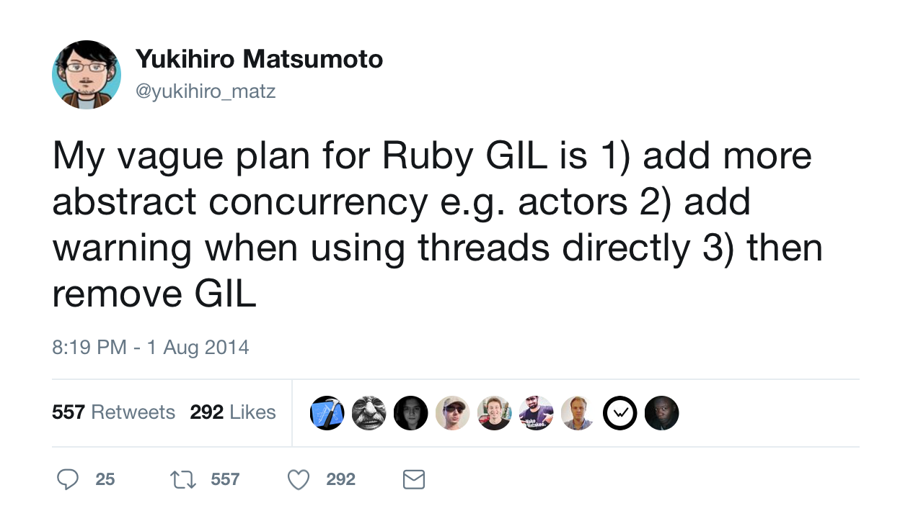

# [fit] Actor Model

---

---

# Fundamental unit of computation
# Not just a form of concurrency

---

# Actor embodies
- Processing
- Storage
- Communication

---

# Properties of Actor
1. Actor has it’s name/address
2. Everything is an actor (An ant is not an ant if it’s single)
3. Actor has a mailbox

---

# Axioms
- When actor receives a message, all it can do is
  1. Create more actors
  1. Send messages to actors that has adresses before
  1. It can say/designate to what it is going to do to next message it receives

---

# Continuations (are not Actors)
- Continuations are single threaded
- Continuations are to decide what you’re going to do next after you finish the current task

---

# Futures
- are Actors that have long computations
- We can pass around futures (e.g. Factorial of 100 million)
- And system’s don’t deadlock

---

# Actors 

 - Gets to decide what to do with incoming messages

—--

# Address of actor != identity
- Actors have addresses
- Many to Many relationship among Actors and Addresses.

---

# Actors can act as proxies.. they can forward messages to another actors

---

# Messages are received in random order
- The system does not enforce this because guaranteeing order is expensive.

---

# Messages are best effort sends.. can be dropped

---

#  There are no channels, Actors talk directly.

^ CSP has inter mediatory named channels to communicate. To get a message, needs a 2 phase commit

---

# Message can be delivered at most once.

---

# Actor model more tied with physics than algebra. 
# CSP is closely tied with Algebra.

---

# Actor model and synchronization
- Synchronization is handled by only one message being handled at a time.
- All you know is that they told you.
- You always have the old news. You can have old news on other side as well.

