# [fit] Avengers

---

# [fit]  immutability 
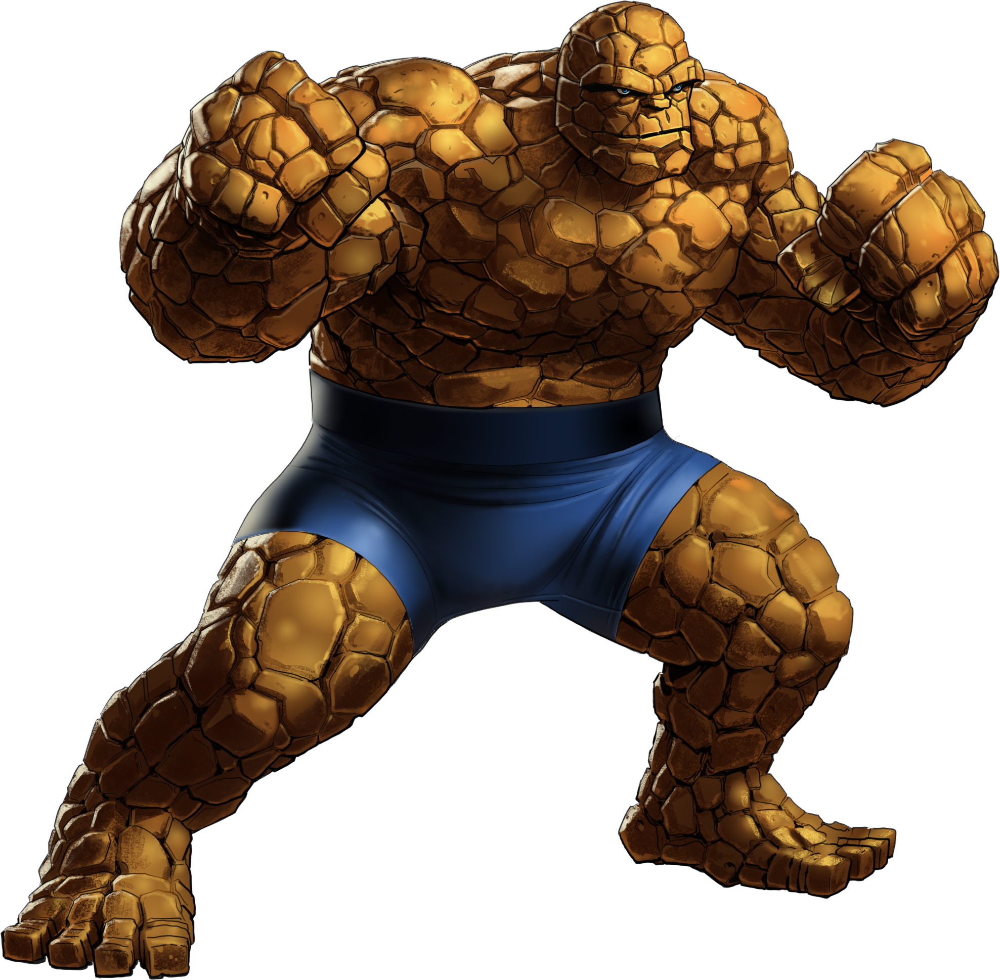

---

# [fit] pure functions 

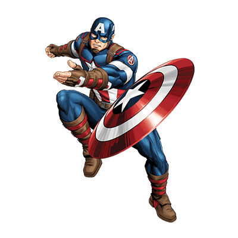

---

# [fit]  cheap processes
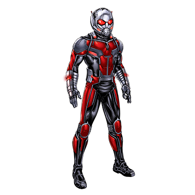

---

# [fit]  actors
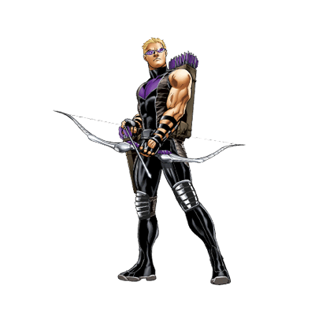

---

# [fit] |> pipe operator
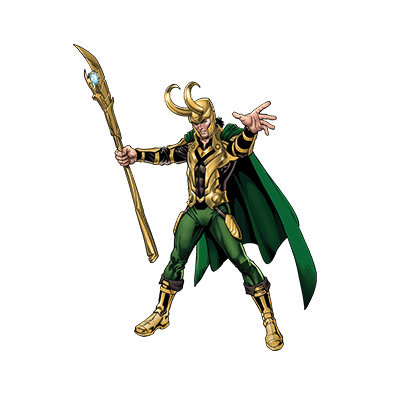

---

# [fit]  distributed
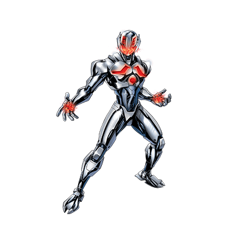

---

# [fit]  scalable 
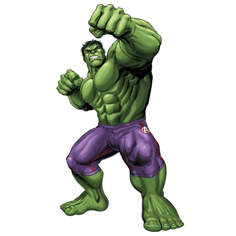

---

# [fit]  highly available
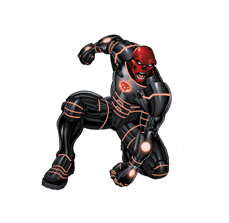

---

# [fit]  message passing
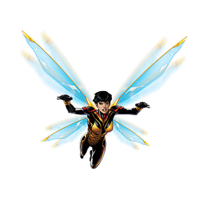

---

# [fit]  pattern matching
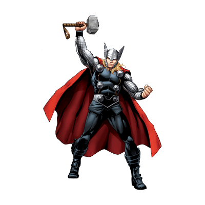

---

# [fit]  fault tolerant
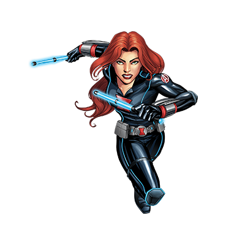

---

# [fit]  Battle tested OTP

---

# [fit]  GenStage and Flow 
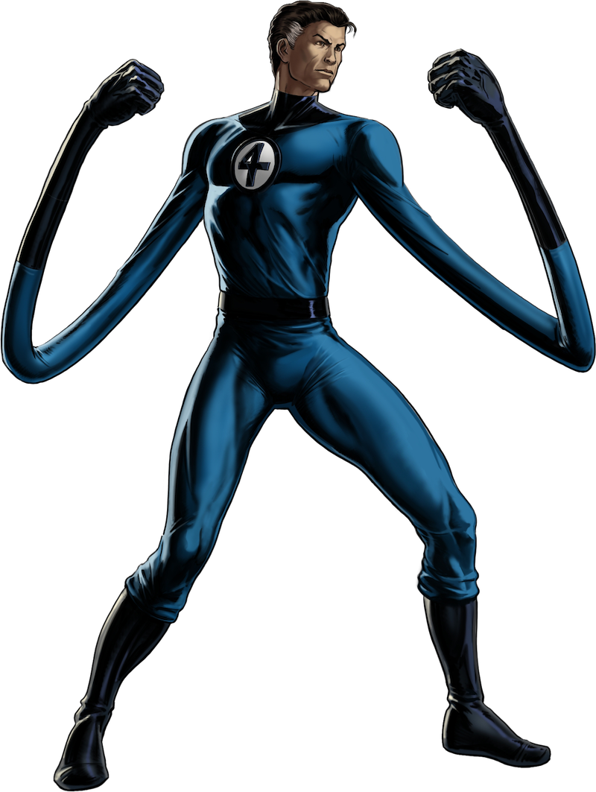

---

# [fit]  mix
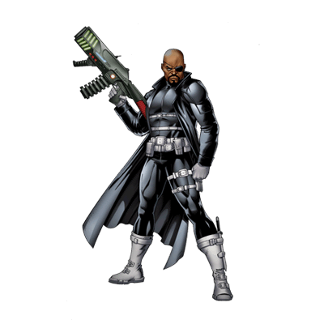

---

# [fit]  Umbrella apps
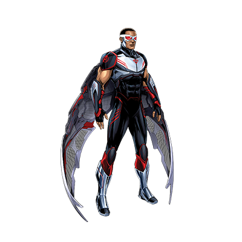

---

# [fit]  Soft realtime
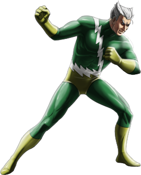

—--

# [fit]  Elixir
